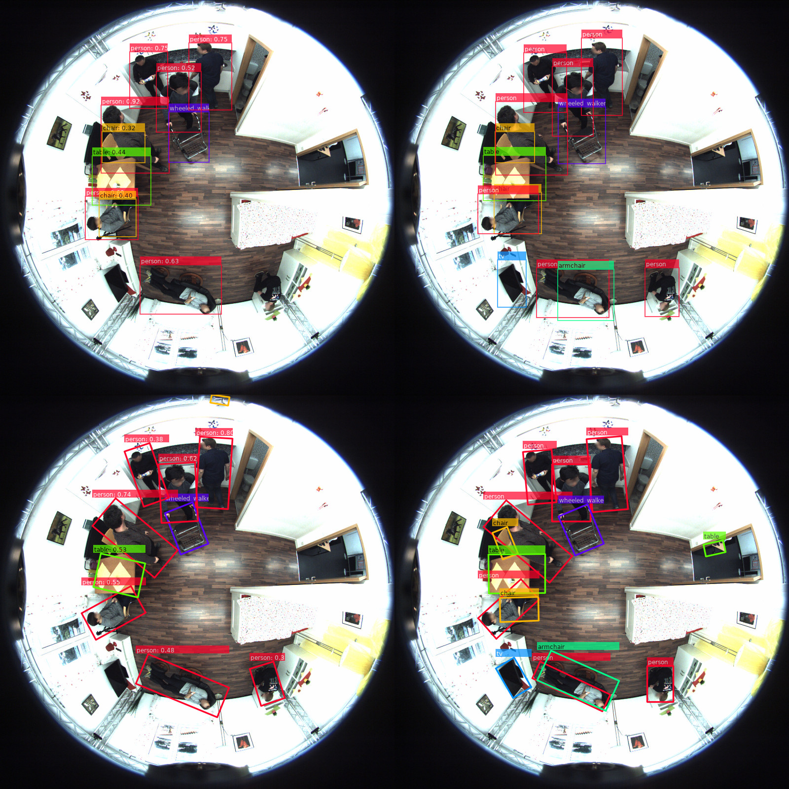

# CenterNet with Unsupervised Domain Adaptation methods
This repository holds a small framework to evaluate unsupervised domain adaptation methods in combination with
a CenterNet object detection network. But it also allows it to train baselines without UDA methods. There also support for rotated bounding boxes as you can see in the Fig. 1 below.


*Fig 1.: Detection example of axis aligned and rotated bounding boxes. The first column is the detection result and the last column the ground truth.*


## Implemented UDA Methods
- [ADVENT](https://arxiv.org/abs/1811.12833)
  - [x] Direct Entropy minimization
  - [x] Minimizing entropy with adversarial learning
- [Domain Adaptation for Semantic Segmentation with Maximum Squares Loss](https://arxiv.org/abs/1909.13589)
  - [x] Max Squares minimization
  - [ ] Image-wise Class-balanced Weighting Factor
  - [ ] Multi-level Self-produced guidance
- [x] [FDA](https://arxiv.org/abs/2004.05498)

## Installation

Install all required modules:

    pip install -r requirements.txt

If you plan to run the DLA network or MobileNet v2 with Deformable Convolutional Networks V2 you have to compile the DCNv2 lib.

    cd libs/DCNv2 && ./make.sh

## Usage
This implementation uses [hydra](https://github.com/facebookresearch/hydra) as configuration framework.
Mainly you can check all available configuration options with:

    python train.py --help

### Training
To run training you can execute the following command which loads the default experiment (configs/defaults.yaml)

    python train.py

A custom experiment will load the default parameters, which you can easily overwrite by placing another yaml configuration file into the folder `configs/experiment/`. E.g. the experiment `entropy_minimization` can be executed with:

    python train.py experiment=entropy_minimization

This file overwrites the attribute `experiment` and the `uda` property.

### Configuration

```yaml
experiment: default # experiment name and also folder name (outputs/default) where logs a.s.o. are saved

# path to pretrained weights
# optimizer states are not restored
pretrained: /mnt/data/Projects/centernet-uda/weights/coco_dla_2x.pth

# path to last trained model
# will restore optimizer states
# if pretraned path is given, resume path is used
resume:

# defines the training model
model:
  # what kind of backend will be used
  # valid values are all available models in backends folder
  # currenlty only dla (Deep Layer Aggregation) is implemented
  backend:
    name: dla
    params: # valid params are listed in e.g. backends.dla.build
      num_layers: 34
      num_classes: 6
    # defines the loss function for centernet (should be as it is)
    # weights can be overwritten if necessary
    loss:
      name: centernet.DetectionLoss
      params:
        hm_weight: 1.0
        off_weight: 1.0
        wh_weight: 0.1
        angle_weight: 1.0 # weight for angle term in loss (only for rotated boxes)
        periodic: False # if true RAPiD periodic loss will be used for angle
  # used unsupervised domain adaptation method for the experiment
  # in this case none UDA method is used, only the centernet is trained
  uda:

datasets:
  # paraemters for training dataset
  training:
    # all available readers are listed in datasets/
    name: datasets.coco
    # valid parameters are all paramters in __init__
    params:
      image_folder: /mnt/data/datasets/theodore_plus/images/
      annotation_file: /mnt/data/datasets/theodore_plus/coco/annotations/instances.json
      target_domain_glob:
        - /mnt/data/datasets/DST/2020-02-14-14h30m47s/*.jpg
        - /mnt/data/datasets/CEPDOF/**/*.jpg
      # data augmentation is implemented via imgaug
      # valid augmentors and parameters are listed here:
      # https://imgaug.readthedocs.io/en/latest/source/overview_of_augmenters.html
      augmentation:
        - GammaContrast:
            gamma: [0.2, 1.5]
        - Affine:
            translate_percent: [-0.1, 0.1]
            scale: [0.8, 1.3]
            rotate: [-45, 45]
        - AdditiveGaussianNoise:
            scale: [0, 10]
        - Fliplr:
            p: 0.5
        - Flipud:
            p: 0.5

  # paraemters for validation dataset
  validation:
    name: datasets.coco
    params:
      image_folder: /mnt/data/datasets/FES/JPEGImages/
      annotation_file: /mnt/data/datasets/FES/coco/annotations/instances_training.json

  # paraemters for test dataset
  test:
    name: datasets.coco
    params:
      image_folder: /mnt/data/datasets/CEPDOF/coco/images/
      annotation_file: /mnt/data/datasets/CEPDOF/coco/annotations/instances_test.json

# parameters to normalize an image, additional to pixel / 255 normalization
normalize:
  mean: [0.40789654, 0.44719302, 0.47026115]
  std: [0.28863828, 0.27408164, 0.27809835]

# all available optimizer from https://pytorch.org/docs/stable/optim.html
# are valid values, e.g. using sgd instead of adam, name should be changed
# to SGD https://pytorch.org/docs/stable/optim.html#torch.optim.SGD
# valid params are all listed params for an optimizer
# e.g. nesterov: True will be valid for SGD but not for Adam
optimizer:
  name: Adam # optimizer
  params:
    lr: 0.0001 # learning rate
  scheduler: # None or one of torch.optim.lr_scheduler
    name: MultiStepLR
    params:
      milestones: [20, 40]
      gamma: 0.1

# which evaluation framework should be used
# currently only mscoco is implemented but can be extended to pascal voc
evaluation:
  coco:
    per_class: True # if true for each class a mAP, Precision and Recall will be logged

tensorboard:
  num_visualizations: 50 # number of images with detections to show in tensorobard
  score_threshold: 0.3 # threshold which should be reached to be a valid bounding box

max_detections: 150 # maximum number of detections per image
epochs: 100 # number of epochs to train
batch_size: 16 # batch size
num_workers: 4 # number of parallel workers are used for the data loader

seed: 42 # random seed
gpu: 0 # gpu id to use for training or list of gpus for multi gpu training
eval_at_n_epoch: 1 # every N epoch the validation will be executed (epoch % N == 0)


# how to identify a "best" model, what metric describes it
save_best_metric:
  name: validation/total_loss # can be training/total_loss, validation/total_loss or MSCOCO_Precision/mAP
  mode: min # what means best for the metric, is smaller (min) better or bigger (max)
```

### Implemented Backends
- [Deep Layer Aggregation](https://arxiv.org/abs/1707.06484) with 34 layers
- [MobileNetV2](https://arxiv.org/abs/1801.04381) with **𝛼** = 1.0
- [ResNet](https://arxiv.org/abs/1512.03385) with 18, 34, 50, 101, 152 layers
- [EfficientNet](https://arxiv.org/abs/1905.11946) Variant b[0 - 8]

## Dataset

To train CenterNet with your own dataset you have to convert it first into the [MS COCO format](https://cocodataset.org/#format-data). Each *file_name* value is specified without a path.

**Image example**

```json
  ...
  "images": [
    {
      "id": 1,
      "width": 1680,
      "height": 1680,
      "file_name": "Record_00600.jpg",
      "license": 0,
      "flickr_url": "",
      "coco_url": "",
      "date_captured": 0
    },
    ...
```

**Annotation example**
As in the example below, there exists a bbox and a rbbox key.

* bbox - axis aligned bounding box like typical for MS COCO (`[x,y,width,height]`)
* rbbox - bounding box in format `[cx, cy, width, height, angle]` ([OpenCV minAreaRect](https://docs.opencv.org/3.4/dd/d49/tutorial_py_contour_features.html))


```json
  {
      "id": 17,
      "image_id": 1,
      "category_id": 1,
      "segmentation": [
        [
          440.66,
          ...,
          575.68
        ]
      ],
      "area": 16656,
      "bbox": [
        403.8,
        538.84,
        163.96,
        147.37
      ],
      "iscrowd": 0,
      "attributes": {
        "occluded": false
      },
      "rbbox": [
        473.5887145996094,
        617.488037109375,
        160.44503784179688,
        141.49945068359375,
        -19.881549835205078
      ]
    }
```


## Development
WIP


### References
> [**Objects as Points**](http://arxiv.org/abs/1904.07850),
> Xingyi Zhou, et al.,
> *arXiv technical report ([arXiv 1904.07850](http://arxiv.org/abs/1904.07850))*

> [**RAPiD: Rotation-Aware People Detection in Overhead Fisheye Images**](https://openaccess.thecvf.com/content_CVPRW_2020/html/w38/Duan_RAPiD_Rotation-Aware_People_Detection_in_Overhead_Fisheye_Images_CVPRW_2020_paper.html),
> Zhihao Duan, Ozan Tezcan, Hayato Nakamura, Prakash Ishwar, Janusz Konrad,
> *Proceedings of the IEEE/CVF Conference on Computer Vision and Pattern Recognition Workshops. 2020*

> [**Advent: Adversarial entropy minimization for domain adaptation in semantic segmentation.**](http://openaccess.thecvf.com/content_CVPR_2019/html/Vu_ADVENT_Adversarial_Entropy_Minimization_for_Domain_Adaptation_in_Semantic_Segmentation_CVPR_2019_paper.html)
> Vu, Tuan-Hung, et al.,
> *Proceedings of the IEEE conference on computer vision and pattern recognition. 2019.*

> [**Domain adaptation for semantic segmentation with maximum squares loss.**](http://openaccess.thecvf.com/content_ICCV_2019/html/Chen_Domain_Adaptation_for_Semantic_Segmentation_With_Maximum_Squares_Loss_ICCV_2019_paper.html)
> Chen, Minghao, et. al.,
> Proceedings of the IEEE International Conference on Computer Vision. 2019